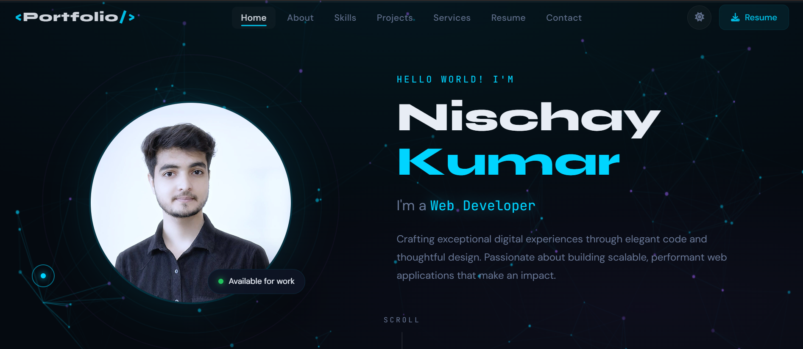
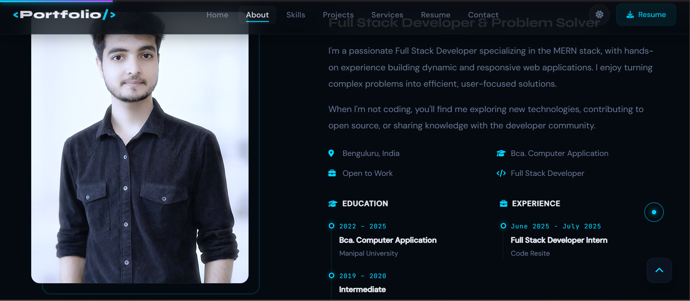
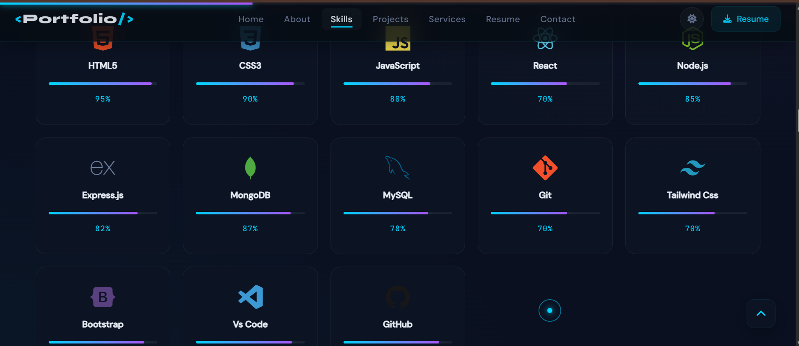
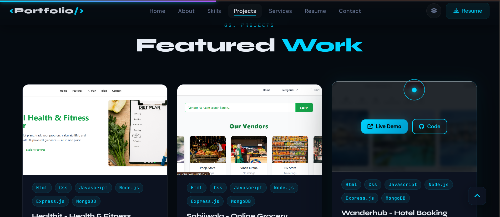
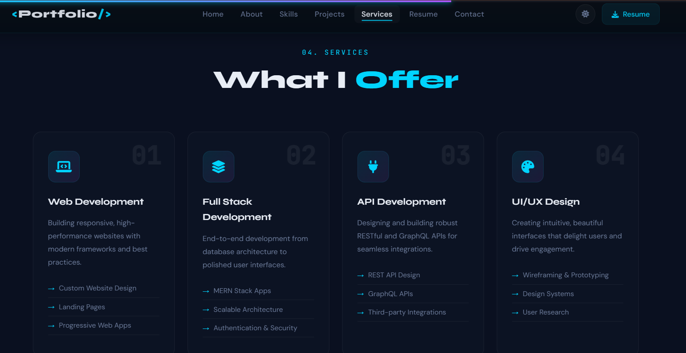
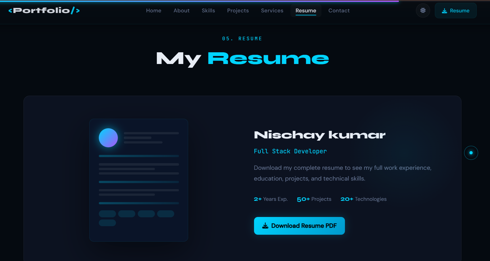
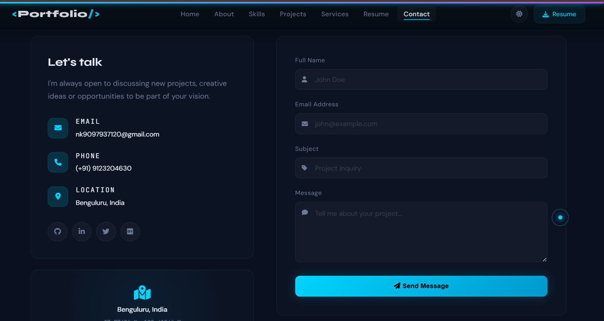
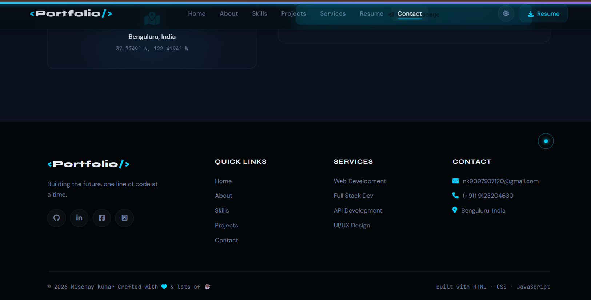

# Nischay Kumar — Developer Portfolio

A fully custom personal developer portfolio built from scratch with modern UI/UX, smooth animations, and zero templates.

🔗 **Live Demo:** https://nk7102001.github.io/Main-Portfolio
🐙 **GitHub:** https://github.com/nk7102001/Main-Portfolio

---

## Screenshots

### Home


### About / Summary


### Skills


### Projects


### Services


### Resume


### Contact


### Footer


---

## Features

- ⚡ Animated Hero section with Typewriter effect (Typed.js) & floating profile image
- 🎨 Custom Canvas Particle background — coded from scratch in Vanilla JS
- 🌙 Dark / Light mode toggle with smooth theme transitions
- 📊 Skills section with animated progress bars
- 🗂️ Projects showcase with live demo & GitHub links
- 📄 Downloadable Resume button
- 📬 Contact form with animated feedback
- 📱 Fully responsive across all screen sizes
- 🔄 Scroll progress bar & preloader animation

---

## Tech Stack

- **Frontend** — HTML5, CSS3, Vanilla JavaScript (ES6+)
- **Animations** — GSAP + ScrollTrigger, AOS.js, Typed.js
- **Icons** — Font Awesome 6, Devicon
- **Fonts** — Google Fonts (Syne, DM Sans, JetBrains Mono)
- **Deployment** — GitHub Pages

---

## Folder Structure

```
Main-Portfolio/
├── index.html          ← Main HTML file
├── css/style.css       ← All styles & animations
├── js/script.js        ← All JavaScript & interactions
├── images/             ← Profile, about & project images
├── resume/             ← Nischay_Kumar_Resume.pdf
├── screenshots/        ← Project screenshots
└── assets/             ← Additional assets
```

---

## Libraries Used

- [AOS.js](https://michalsnik.github.io/aos/) — Scroll animations
- [GSAP + ScrollTrigger](https://greensock.com/gsap/) — Advanced animations
- [Typed.js](https://mattboldt.com/demos/typed-js/) — Typewriter effect
- Custom Canvas Particles — Built from scratch in Vanilla JS
- [Font Awesome 6](https://fontawesome.com/) — Icons
- [Devicon](https://devicon.dev/) — Tech stack icons
- [Google Fonts](https://fonts.google.com/) — Syne, DM Sans, JetBrains Mono

---

## License

Free to use for educational and personal projects.